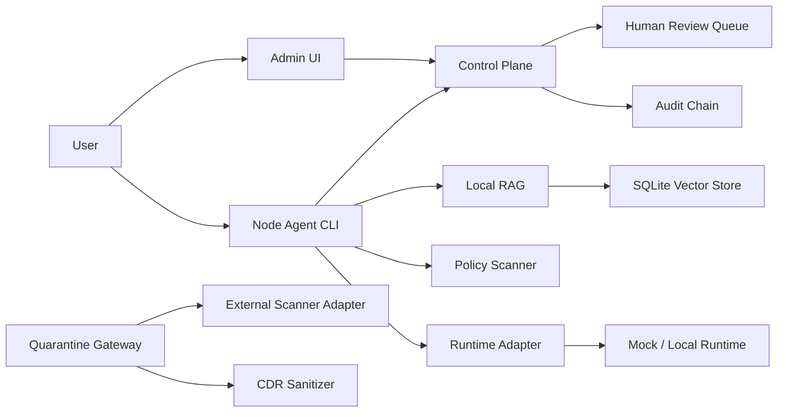

# GovMesh Local AI Node

GovMesh Local AI Node is a local-first AI node for security-constrained organizations. It is designed to run on Windows work PCs and demonstrate document indexing, PII detection, RAG queries, quarantine intake, human review, audit logging, and release evidence without using real confidential data.

The project is not about calling the largest possible model. It is about building a small, inspectable operating layer for local AI work where documents, evidence, and governance decisions can be reviewed.

## Architecture



## Quick Start

Use Windows PowerShell:

```powershell
git clone https://github.com/sinmb79/GovMesh_Local_AI_Node.git
cd GovMesh_Local_AI_Node
python -m pip install -e .[dev]
python scripts/setup_local_env.py
. .\.govmesh-local\env.ps1
python scripts/govmesh_doctor.py
python -m pytest
```

Try a sample local workflow:

```powershell
python -m apps.node_agent performance-doctor
python -m apps.node_agent scan-folder --path samples/documents
python -m apps.node_agent query --sample samples/documents --question "Summarize this with cited evidence."
```

## Run Local Services

```powershell
.\scripts\install.ps1
.\scripts\start_local_stack.ps1
.\scripts\stop_local_stack.ps1
```

The services bind to `127.0.0.1` by default.

## Safety Baseline

- Do not use real government data in tests or samples.
- Do not use real personal information in tests or samples.
- Do not store raw PII in audit logs.
- Do not expose local APIs externally without an approved gateway and policy.
- Do not run unapproved skills, models, or runtime binaries.

## Release Bundle

```powershell
python scripts/build_release_bundle.py
```

Outputs:

```text
dist/govmesh-local-ai-node-v0.3.1.zip
dist/SHA256SUMS.txt
dist/release_manifest.json
```

## Documentation

- [Korean getting started guide](docs/GETTING_STARTED_KO.md)
- [Windows install guide](docs/INSTALL_WINDOWS.md)
- [Distribution guide](docs/DISTRIBUTION.md)
- [Runbook](docs/RUNBOOK.md)
- [Security model](docs/SECURITY_MODEL.md)
- [API spec](docs/API_SPEC.md)

## License

MIT License
