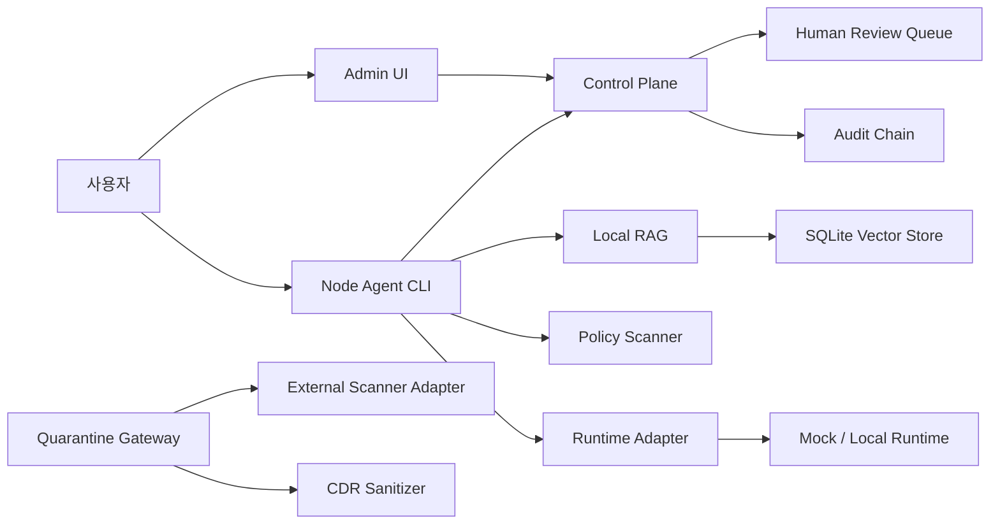

# GovMesh Local AI Node

[English README](README.en.md)

## 시스템 구조



정부·공공기관처럼 보안 제약이 큰 환경을 가정한 **로컬 우선 AI 노드**입니다. Windows 업무 PC에서도 문서 점검, 개인정보 탐지, RAG 질의, 반입물 격리, 사람 검토, 감사 로그, 릴리즈 증빙을 한 흐름으로 시험할 수 있게 만든 공개 MVP입니다.

GovMesh의 목표는 “큰 모델 하나를 외부에서 호출하는 것”이 아니라, 내부 문서를 안전하게 다루고 근거와 감사 흔적을 남기는 작은 로컬 운영 체계를 만드는 것입니다.

## 바로 써보기

Windows PowerShell 기준입니다.

```powershell
git clone https://github.com/sinmb79/GovMesh_Local_AI_Node.git
cd GovMesh_Local_AI_Node
python -m pip install -e .[dev]
python scripts/setup_local_env.py
. .\.govmesh-local\env.ps1
python scripts/govmesh_doctor.py
python -m pytest
```

샘플 문서로 점검과 질의를 실행합니다.

```powershell
python -m apps.node_agent performance-doctor
python -m apps.node_agent scan-folder --path samples/documents
python -m apps.node_agent query --sample samples/documents --question "근거 문서를 바탕으로 요약해줘"
```

## 로컬 서버 실행

```powershell
. .\.govmesh-local\env.ps1
python -m apps.control_plane
```

다른 PowerShell 창에서:

```powershell
. .\.govmesh-local\env.ps1
python -m apps.quarantine_gateway
```

Admin UI:

```powershell
. .\.govmesh-local\env.ps1
python -m apps.admin_ui --control-plane http://127.0.0.1:8787 --serve
```

또는 보조 스크립트를 사용할 수 있습니다.

```powershell
.\scripts\install.ps1
.\scripts\start_local_stack.ps1
.\scripts\stop_local_stack.ps1
```

## 주요 기능

- Control Plane: 노드 등록, 작업 큐, 감사 이벤트, 벤치마크, 사람 검토 큐
- Node Agent CLI: PC 성능 진단, 폴더 정책 점검, RAG 질의, worker loop
- Policy Scanner: 개인정보, 내부문서 표식, prompt injection 후보 탐지
- Local RAG: 한국어 chunking, mock embedding, SQLite vector store
- Runtime Adapter: mock LLM, 승인된 llama.cpp 실행 파일/모델 hash pinning
- Quarantine Gateway: upload → scan → sanitize → approve/reject
- External Scanner Adapter: AV/YARA/CDR 도구를 hash pinning 후 JSON 계약으로 실행
- CDR: 텍스트 계열 파일 제어문자 제거와 개인정보 마스킹 산출물 생성
- Human Review Queue: 원문 대신 summary, content hash, evidence ID 중심 검토 기록
- Audit Chain: JSONL hash chain, HMAC signature, checkpoint store
- Evidence Package: 테스트, release gate, 파일 manifest, governance summary 생성

## 보안 기본값

- 실제 정부 데이터 사용 금지
- 실제 개인정보 사용 금지
- API 기본 bind는 `127.0.0.1`
- 운영 서버는 bearer token 없이는 시작하지 않음
- 감사 로그에 raw PII 저장 금지
- 승인되지 않은 skill/model/runtime 실행 차단
- 민감 RAG chunk는 기본 검색 결과에서 제외
- SSO/mTLS는 trusted proxy header signature와 client certificate fingerprint로 연동 가능

## 배포 파일 만들기

```powershell
python scripts/build_release_bundle.py
```

출력:

```text
dist/govmesh-local-ai-node-v0.3.1.zip
dist/SHA256SUMS.txt
dist/release_manifest.json
```

릴리즈 전 검증:

```powershell
python scripts/release_gate.py
python scripts/build_evidence_package.py
```

## 문서

- [처음 시작하기](docs/GETTING_STARTED_KO.md)
- [Windows 설치 가이드](docs/INSTALL_WINDOWS.md)
- [배포 가이드](docs/DISTRIBUTION.md)
- [실행 가이드](docs/RUNBOOK.md)
- [보안 모델](docs/SECURITY_MODEL.md)
- [보안 보완 노트](docs/HARDENING_NOTES.md)
- [리스크 레지스터](docs/RISK_REGISTER.md)
- [API 스펙](docs/API_SPEC.md)
- [릴리즈 체크리스트](docs/RELEASE_CHECKLIST.md)

## 현재 검증 상태

- `python -m pytest`
- `python scripts/release_gate.py`
- GitHub Actions CI

위 세 경로로 검증합니다.

## 라이선스

MIT License
